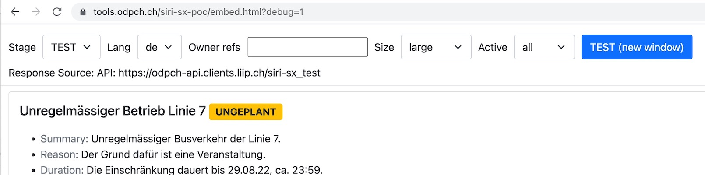

# Embed SIRI SX Response

This page explains how to integrate SIRI request and consume the response in an web IFRAME.

## URLs

https://tools.odpch.ch/siri-sx-poc/embed.html

- by default all `//PtSituationElement/` response nodes having a `//PublishingAction` child are shown
- the messages can be filtered also by various params, see below
- the messages are `<PublishingAction>` children of `<PtSituation>` nodes, there is 1-many reltionshop between them
- sorting is done by unplanned messages first (using `Planned` node) then most recent messages to oldest (using `CreationTime` node)

## Query Parameters

All parameters are optional, the default values are used instead.

| Param | Values | Default | Description |
|-|-|-|-|
| lang | `de`, `en`, `fr`, `it`  | `de` | Messages textual content language |
| text_size | `small`, `medium`, `large`  | `large` | Messages textual content text size |
| text | String |  | Comma separated strings of the `OwnerRef` or `SituationNumber`. Example: `100602` for PostAuto - full list: [Business Organisations](https://opentransportdata.swiss/en/dataset/goch) dataset.  |
| active | `1` |  | Show only active messages (based on `ValidityPeriod`) |
| app_stage | `TEST`, `INT`  | `TEST` | Backend API configuration, `TEST` for `siri-sx_test`, `INT` for `siri-sx_int` API endpoints |
| scopeType | `line`, `stopPlace`, `vehicleJourney`  | `-` | Filter situations by scope type |
| perspective | `general`, `line`, `stopPoint`, `vehicleJourney`  | `-` | Filter `PublishingAction` by perspective |
| debug | `1`  |  | Debug flag to show more information about the messages and also provide a GUI to customise the parameters |

## Build Integration URL

The parameters above are configurable via the [URL builder](https://tools.odpch.ch/siri-sx-poc/embed.html?debug=1) tool



Link: https://tools.odpch.ch/siri-sx-poc/embed.html?debug=1

Changing the dropdown and input values will reload the content of the messages so the user can have a direct feedback of how the integration will look like. 

Click the `TEST (new window)` button to open in a new window the integration and check if the content is rendered as expected.

Examples:

- [link1 on TEST](https://tools.odpch.ch/siri-sx-poc/embed.html?app_stage=TEST&lang=fr&text_size=medium) - messages in **french** language, with text context size **medium**
- [link2 on TEST](https://tools.odpch.ch/siri-sx-poc/embed.html?app_stage=TEST&lang=fr&owner_refs=100602&text_size=medium) - messages in **french**, with text context size **medium**, for `OwnerRef` 100602

The URL can be then embeded in a HTML IFRAME as in the following example:
```
<iframe 
    width="100%" height="500" 
    src="https://tools.odpch.ch/siri-sx-poc/embed.html?app_stage=TEST&lang=fr&text_size=medium"></iframe>
```
---

## Document Revisions

- 2024-12-12 - documented `perspective` param, updated general info
- 2024-06-18 - documented `scopeType` and `text` params
- 2022-07-29 - documented the [URL builder](https://tools.odpch.ch/siri-sx-poc/embed.html?debug=1) tool
- 2022-07-21 - documented sorting, added `debug` param
- 2022-07-20 - added `active` query parameter
- 2022-07-18 - created first version
